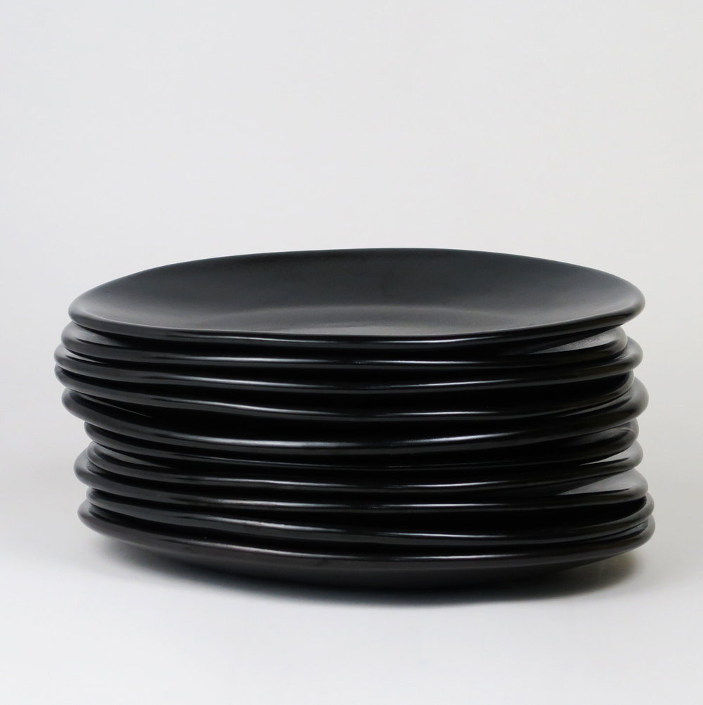

# Python DSA reminder
## Datastructures and algorithms using python

*This code is not made for dummies*
*The developer created it as a DSA reminder*
*Some expirience with DSA is needed*
**Most of the code has been learnt from udemy**

**So far the DSA code consists of**
* Recusion
    1. Fibonachi
    2. Factorial
    3. Recursion vs Iteration
* Big O notation
    1. Time complexity
    2. Space complexity

