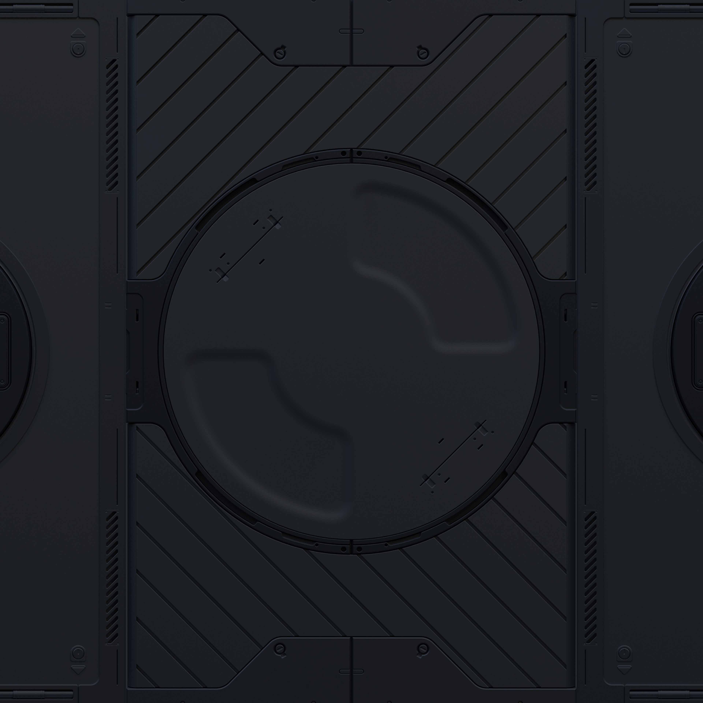

# Python DSA reminder
## Datastructures and algorithms using python

*This code is not made for dummies*
*The developer created it as a DSA reminder*
*Some expirience with DSA is needed*
**Most of the code has been learnt from udemy**

**So far the DSA code consists of**
* Recusion
    1. Fibonachi
    2. Factorial
    3. Recursion vs Iteration
* Big O notation
    1. Time complexity
    2. Space complexity

* Arrays 
    1. Operations on arrays
    2. Time and space complexity
* Lists
    1. Operations on lists
    2. Common pitfalls and ways to avoid them 
    3. Time and space complexity

* Dictionaries
    1. Operations on dictionaries
    2. Time and space complexity
* Tuples
    1. Operations on Tuples
    2. Time and space complexity

* Linked Lists
    1. Types of linked lists
    2. Time and space complexity
    3. Time and space complexity of linked lists vs arrays

